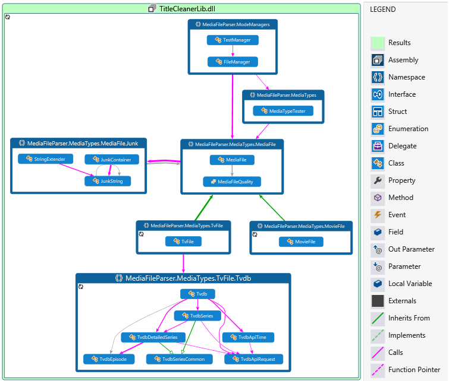

TitleCleaner
============

Cleans and renames the titles of downloaded media files (tv/movies).
Also incorporates functionality to retrieve missing TV Show titles from the TVDB as well as relocate files to appropriate storage locations (eg rename and move from a downloads folder to some media directory).

If there is insufficient information the program will make a best effort approach when trying to find names.

Library: 
---
Download latest release [here](https://github.com/mrkno/TitleCleaner/releases/download/v2.0.23.14334/TitleCleanerLib.zip).
Examples of how to use are the tc-cli and tc-gui projects. Also included is XML documentation and a pdb debugging file.
A general overview of the classes in the library can be seen below: 

GUI: 
---
Download latest release [here](https://github.com/mrkno/TitleCleaner/releases/download/v2.0.23.14334/tc-gui.zip). Usage of the GUI is fairly self explanatory however any part that is undocumented works in a similar if not identical way to the CLI interface below. If a feature is undocumented, unexplained or otherwise refer to the CLI options and documentation for more information.

CLI: 
---
Download latest release [here](https://github.com/mrkno/TitleCleaner/releases/download/v2.0.23.14334/tc-cli.zip)
 <code>tc-cli.exe [OPTION]...</code>
 <b>Usage Examples:</b> 
*<code>tc-cli.exe -i -c -v "N - \SS\Ee?( - T).E"</code> This will ask for confirmation, query the TVDB and output TV files in the format <code>SeriesName - SXXEXX.ext</code> or <code>SeriesName - SXXEXX - EpisodeTitle.ext</code> if EpisodeTitle exists. 
*<code>tc-cli.exe -s "C?( Y)?( (P)).E"</code> This will output files in the default format, optionally appending Year and file part number if they are known.

	If no options are specified defaults will be used.
	-m, --mode
		The {MODE} to run this application in (normal/test).
		
	-t, --type
		The {TYPE} of media files being input (tv/movie/auto).
		
	-i, --tvdb
		Retreives new missing tv episode names from the TVDB.
		
	-c, --confirm
		Asks for confirmation on rename/move/test.
		
	-o, --out
		Move media files to {DIRECTORY}. In test mode this outputs the outcomes
		of the test cases to the specified file.
		
	-s, --format
		{FORMAT} to use for output file naming. Supports the following characters:
			L: Location
			O: Origional Filename
			C: Cleaned Filename
			E: File Extension
			Y: Year (or if year is unknown, current year)
			P: Part of File
			?: Only return next character group if it is not null/empty/whitespace
			\: Return Next Character
		
	-v, --tformat
		{FORMAT} to use for output TV file naming. This option overrides the -s option.
		Supports the same characters as the -s option as well as:
			T: Title of the Episode
			N: Name of the Episode
			S: Season Number of the Episode (Padded to 2sf)
			s: Season Number of the Episode
			e: Episode Number of the Episode
		
	-e, --mformat
		{FORMAT} to use for output movie file naming. This option overrides the -s option.
		Supports the same characters as the -s option.
		
	-h, --help
		Display this help.
		
	-w, --tvdir
		Sets the output directory subdirectory for tv files.
		
	-r, --movdir
		Sets the output directory subdirectory for movie files.
			
	-d, --directory
		The {DIRECTORY} to search for files. When used the directory provided will be
		searched instead of the current directory for media files.
		This option is mutually exclusive with -f.
		
	-f, --file
		Cleans an individual {FILE} instead of searching. The behaviour of the application
		is otherwise unchanged. This option is mutually exclusive with -d. In test mode
		this specifies a test .csv file to run.

A full list of the test cases that TitleCleaner is run against (with default options) can be found  [here](https://github.com/mrkno/TitleCleaner/blob/master/MediaFileParser/Tests/tests.csv). 
5/2821 Tests are failing as of 18:55:09 NZST 30/11/14. 
This list always requires expansion so feel free to contribute them in a similar csv format.

This is an improved version of the original mess located here:
https://code.google.com/p/title-cleaner

Any contributions/pull requests welcome.

License changed to the MIT Licence.
